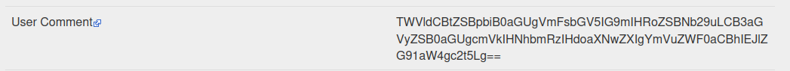
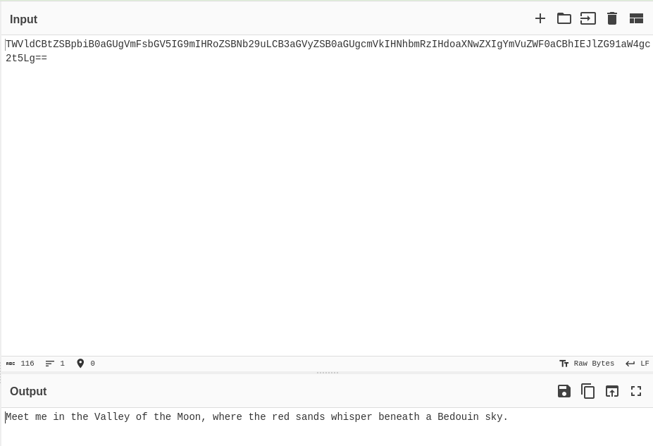

**Challenge link**: https://osintchallenges.com/?weekly_challenge=satoshi-tribute-address-daily-received-total

## Objectives
Your mission is to analyze the image file and determine the real-world location referenced in the hidden message.

## Solution
Some good old-fashioned image forensics, haven't done that in a while. Depending on your OS, it can be quite trivial to install a tool called _EXIF Tools_ to analyze the matadata of an image. For simplicity's sake, I will just use https://exif.tools

Ok, we got something...let's see what CyberChef has to say about this base64 encoded command:

_Meet me in the Valley of the Moon, where the red sands whisper beneath a Bedouin sky._ hmm...let's google this and we got our flag:

https://www.peek.com/wadi-rum-village-aqaba-governorate-jordan/r06d7q/wadi-rum-a-spiritual-odyssey-through-the-desert-sands/ar0rdbwe

## Flag
See link above