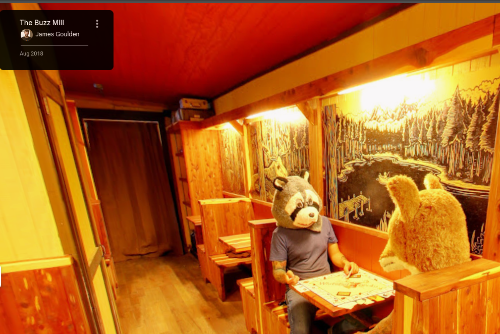

**Challenge link**: https://osintchallenges.com/?weekly_challenge=unexpected-guests

## Objectives
Find the location of this image: 

## Solution
If we try to reverse image search via google images, one of the links returned will be this link:
https://www.gmapswidget.com/funny-google-maps-street-view/

With the following description:

`For some images, you will have to explore a little bit more in detail. In this example, if you open up The Buzz Mill bar in Texas, everything seems to be normal. Tables are ready for customers and it seems that the bar is empty. But if you follow this adventure and you and click on the next room, you might find a surprise. The bar isn’t empty and there are four “Furries” sitting in the back. Were those guys just joking around, is that part of the lost bet or maybe a movie in the making, we’ll probably never know.`

So, the location is _The Buzz Mill in Texas_.

A little bit more googling and it seems that it's quite popular: https://www.express.co.uk/travel/articles/1211251/Google-maps-street-view-US-texas-pub-animal-heads-weird-funny-viral

On Google maps, search for The Buzz Mill Bar, Texas. Then select street view and change year to 2021 and move around a bit, you will see the guys in the room.

## Flag
*-Austin, Texas, USA, 2018

